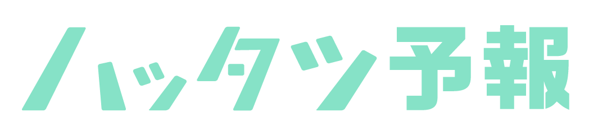
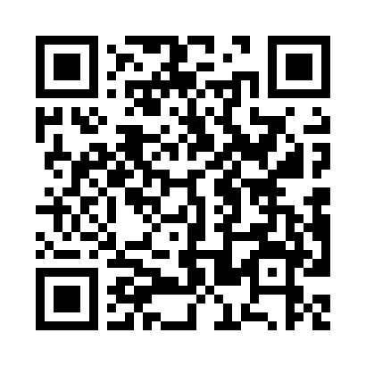

# ハッタツソン 2019

 

* チームじょがりこ作品

---

## アプリ名

---

## 背景／課題

 

* 人生うまく行かないことが多い  
 
* 発達障害の当事者は、特に悩みが多い

---

* 自分の振る舞いで、  
世間との軋轢の**「きっかけ」**  
になっているのってどんなところ？  
 

* 自覚があるものもあれば、  
<u>自分では気が付いていない</u>ものも？

---

## 解決のためのアプリ！

 

1. 自分の**「気になっていること」**を決め、  
 
1. 日々**ロギング**していくと…  
 
1. **AI** が<u>「その日どうなるか」</u>を教えてくれる！

---

## このアプリの使い方

* 初めに**普段どうもうまくいかないこと**を入力
	* 例）「体調」や「眠気」などの  
	○△×を教えてほしい場合  
	→「体調」や「ねむけ」を入力  
 
* 毎夜、今日の「体調」や「ねむけ」が  
どうだったかを○△×で入力する。

---

## このアプリの特徴！

* 自分専用にカスタマイズ可能！
	* AI が自分の課題に**特化！**  
 
* （将来対応）  
自分が「あたり」が付いている内容を  
ロギングの対象として追加可能
	* 当たっていれば、  
	AI の**予想精度**が向上！

---

### どうやって 予想できるようにする？

---

1. （朝、**自分の予想**を登録）
1. 夜、**結果**を登録  
 
1. 深夜〜早朝、AI 処理
	* 前日までの情報を**学習**
	* 天気の取得
	* 予想を**送信**  
 
 
* 毎日 1. または 2. から繰り返し実施

---

## 画面デザイン集

 

* [こちらからどうぞ](../20190505_htttthon_design/)  
 
* 画像集のため、  
GIGA の消費にご注意ください。

---

#### ありがとうございました

* このスライドへのリンクです。  
よろしければご覧ください。
