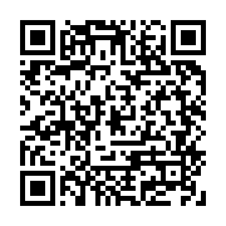

# アクセシビリティ の祭典 2019

 

* face count reporter

---

## 開発の背景

 

* 機能障害の解決には多くの場合  
<b>ハードウェア（装置）</b>が必要  
 
* ソフトウェアで貢献できることは？
	* <b>認識サポート</b>
		* 「視覚補助」や「聴覚補助」

---

## お困りのこと（想像）

 

* 視覚が無いのはかなり大変そう
	* 音声情報は <b>「１次元情報（ストリーム）」</b>  
	なので、<u>俯瞰することができない。</u>
		* <b>このスライドも認識できない。</b>

---

### 視覚障害者が「俯瞰」するには

* 触覚なら可能？

* [Apple や Microsoft が、 **点字ディスプレイ** の 規格統一に向けて協力。どんなホストデバイス でも使えるアクセシビリティを目指して](https://www.gizmodo.jp/2018/06/usb-baille-displays.html)

* [視覚障害を抱える人に光をもたらす５つの発明品](https://www.redbull.com/jp-ja/inventions-to-help-visually-impaired-people)
	* [**Dot Watch:** 視覚障害者にも晴眼者にも便利な 革新的点字スマートウォッチ](https://www.thxpalm.com/2018/07/dot-watch.html?m=1)  

* 高い。手に入らない。…断念

---

## 一方、世の中の状況

* 昨今の **AI の隆盛** によって、  
視覚と聴覚を補う手段は増えてきた。
	* ハードは最小限でも色々できる
		* ディスプレイ for 聴覚サポート
		* スピーカー for 視覚サポート  
 
* まずはありものでプロトタイプを

---

## 作りました

1. ボタンを押す  
 
1. 前方の写真を取る  
 
1. **写っている人** の<u>人数を数える</u>
	* AI を利用  
 
1. **発話で知らせる**
	* 「○人です」

---

## システム構成

1. [dash button](https://aws.amazon.com/jp/iotbutton/)  
 
1. [USB UVC Camera](https://elinux.org/RPi_USB_Webcams)  
 
1. [Google Edge TPU](https://aiyprojects.withgoogle.com/edge-tpu/)
	* [MobileNet SSD v2 (Faces)](https://coral.withgoogle.com/models/)  
 
1. [発話機能 (TTS) : **AquesTalk Pi**](https://www.a-quest.com/products/aquestalkpi.html)

---

## 各機能について

 

* 今回はオンラインの機能は使わず、  
全てローカルの機能で構成。
	* WAN への接続は不要。
	* dash ボタンを別の機構に置き換えれば  
	LAN 接続も不要（スタンドアロン）です。

---

## 各機能アレンジ案

 

* お困り事（想像）対応案

---

## 認識対象の変更

1. 点字タイル
	* 位置、距離  
 
1. 文字認識
	* 案内板など  
 
1. 風景
	* 知っている所 or not

---

## 起動方法の変更

1. 普通のボタン（有線接続）
	* [RPi.GPIO](https://tool-lab.com/make/raspberrypi-startup-26/) 経由  
 
1. [micro:bit](https://microbit.org/ja/guide/) のボタン
	* Bluetooth 経由など  
 
1. ボタン以外
	* 音声認識など

---

## 通知手段の変更

1. 点字ディスプレイ  
 
1. Dot Watch  
 
1. その他

---

##### ありがとうございました

* このスライドへのリンクです。  
よろしければご覧ください。

---

## in English (partial)

---

### functions

1. button
	* micro:bit
	* dash button
1. image capture
	* uvc camera
1. face detection
	* edge tpu + mobilenet v2
1. voice play
	* aquestalk-pi

---

## EOF
